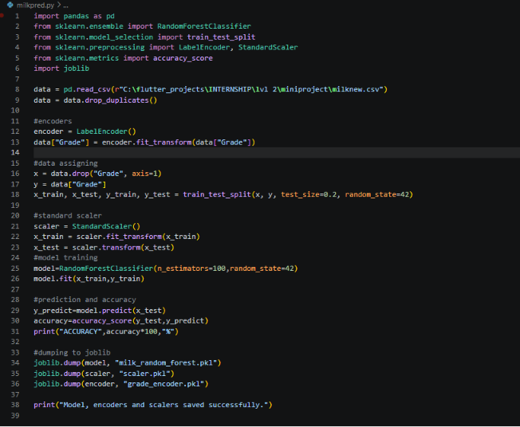
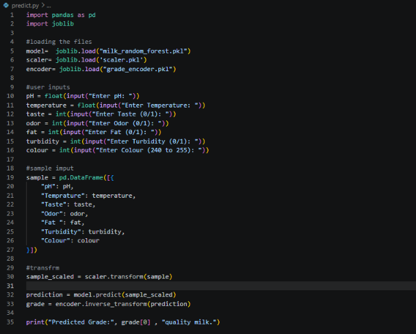
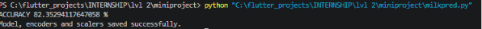
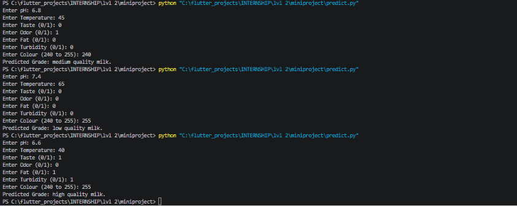

# MINI-PROJECT-1
Level 2 Mini Project by Mithra Nandhana BA

## Problem Statement
This project uses Machine Learning to predict the quality grade of milk based on various physical and chemical characteristics. A Random Forest Classifier was implemented to classify milk samples into High, Medium, and Low quality categories.

## Answer
### Model
Random Forest Classifier

### Performance
Accuracy: 82.35294117647058 %

### File Structure
The source code is saved in

The binary files are saved in 

The CSV file is accessed at 

For the documentation

## *Code*
**program code**

**predict code**

## *Output*
**program output**

**predict output**

## Dataset Source

:D
